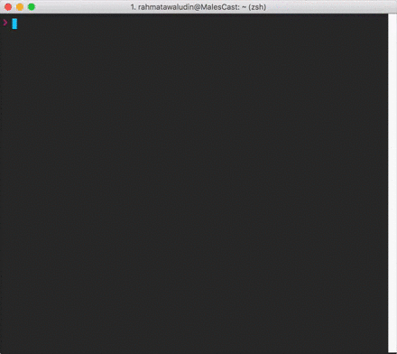

# focus
> Todo.txt powered extra focus for your terminal



## Install
1. Install [todo.txt](https://github.com/ginatrapani/todo.txt-cli/wiki/Quick-Start-Guide)
2. Run `curl https://raw.githubusercontent.com/rahmatawaludin/focus.sh/master/focus -o focus && chmod +x focus`

## Usage
```
$ focus help
Usage:
focus            : show current focus
focus id         : show current todo.sh id
focus now <text> : now new focus
focus list       : list all focus
focus done       : mark current focus as done
```

## How it work?
* This script list all todo.txt entry with `+focus`.
* It use LIFO (Last In First Out) to prioritize which task is shown.
* When adding new task, its add `+focus` to the task.

## Tips
You can use this tools to complement your zsh or tmux theme. The Gif above is using tmux to show my focus.

If you use [tmuxline](https://github.com/edkolev/tmuxline.vim), here is the settings I use:
```
let g:tmuxline_preset = {
      \'a'               : '#{?client_prefix,#[reverse][P]#[noreverse] ,}#{?window_zoomed_flag,#[reverse][F]#[noreverse] ,}#S',
      \'win'             : ['#I', '#W'],
      \'cwin'            : ['#I', '#W'],
      \'x'               : '#(focus)',
      \'y'               : ['%a, %b %d'],
      \'z'               : '%R',
      \'options'         : {
        \'status-justify'  : 'left'}
      \}
```

Which translated to tmux configuration like this:
```
set -g status-bg "colour24"
set -g message-command-fg "colour254"
set -g status-justify "left"
set -g status-left-length "100"
set -g status "on"
set -g pane-active-border-fg "colour254"
set -g message-bg "colour31"
set -g status-right-length "100"
set -g status-right-attr "none"
set -g message-fg "colour254"
set -g message-command-bg "colour31"
set -g status-attr "none"
set -g status-utf8 "on"
set -g pane-border-fg "colour31"
set -g status-left-attr "none"
setw -g window-status-fg "colour255"
setw -g window-status-attr "none"
setw -g window-status-activity-bg "colour24"
setw -g window-status-activity-attr "none"
setw -g window-status-activity-fg "colour254"
setw -g window-status-separator ""
setw -g window-status-bg "colour24"
set -g status-left "#[fg=colour240,bg=colour254] #{?client_prefix,#[reverse][P]#[noreverse] ,}#{?window_zoomed_flag,#[reverse][F]#[noreverse] ,}#S #[fg=colour254,bg=colour24,nobold,nounderscore,noitalics]"
set -g status-right "#[fg=colour24,bg=colour24,nobold,nounderscore,noitalics]#[fg=colour255,bg=colour24] #(focus) #[fg=colour31,bg=colour24,nobold,nounderscore,noitalics]#[fg=colour254,bg=colour31] %a, %b %d #[fg=colour254,bg=colour31,nobold,nounderscore,noitalics]#[fg=colour240,bg=colour254] %R "
setw -g window-status-format "#[fg=colour24,bg=colour24,nobold,nounderscore,noitalics]#[default] #I  #W #[fg=colour24,bg=colour24,nobold,nounderscore,noitalics]"
setw -g window-status-current-format "#[fg=colour24,bg=colour31,nobold,nounderscore,noitalics]#[fg=colour254,bg=colour31] #I  #W #[fg=colour31,bg=colour24,nobold,nounderscore,noitalics]"
```

## Todo
- [ ] Add better installer (homebrew?)
- [ ] Allow for priority
- [x] Add sample configuration for tmux

P.S: Pull request are welcome.. :)

## License

MIT © [Rahmat Awaludin](http://twitter.com/rahmatawaludin)
